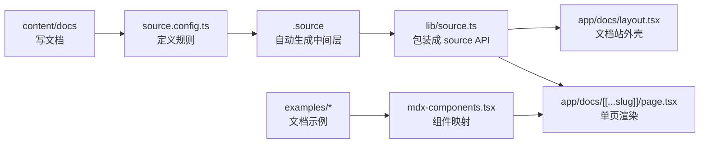
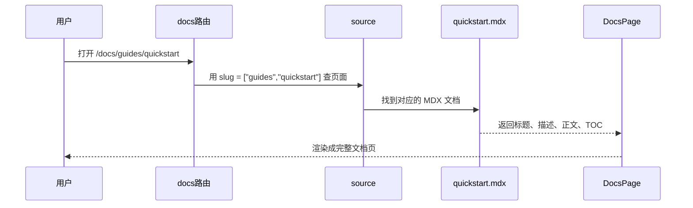
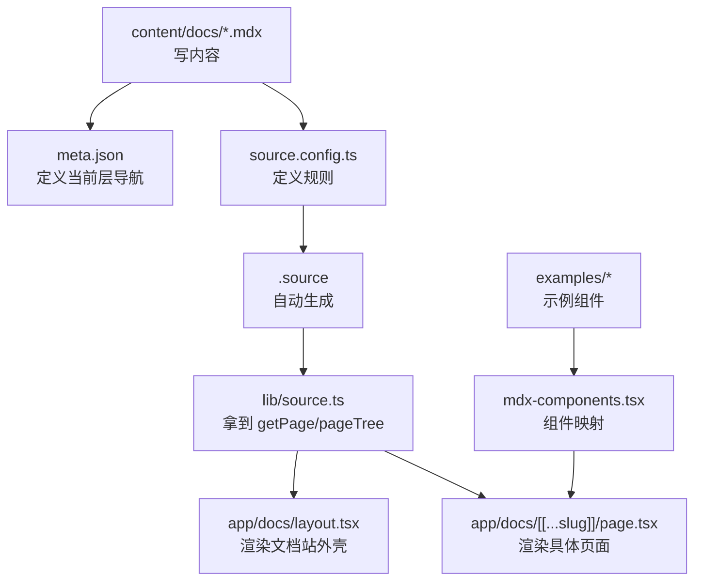

## 导航速览

1. [简介](#1-简介)
2. [整体工作链路](#2-整体工作链路)
3. [Fumadocs 的组成](#3-fumadocs-的组成)
4. [核心文件详解](#4-核心文件详解)
5. [`app/docs/layout.tsx` 与 `app/docs/[[...slug]]/page.tsx`](#5-appdocslayouttsx-与-appdocsslugpagetsx)
6. [`mdx-components.tsx` 与 `examples/*`](#6-mdx-componentstsx-与-examples)
7. [几个常见误区](#7-几个常见误区)
8. [总结与复盘](#8-总结与复盘)
9. [参考资料](#9-参考资料)

---

## 1. 简介

`Fumadocs` 是一个围绕 `Next.js App Router` 构建的文档系统方案。它不只是"一个文档主题"，而是由 `fumadocs-core`、`fumadocs-ui`、内容源（如 `fumadocs-mdx`）和 `Next.js App Router` 组合构成的完整能力组合，更适合被理解成"文档系统组合方案"，而不是单一的黑盒框架。

对于刚接触 Fumadocs 的同学，最难的往往不是 API 本身，而是搞清楚：

- 文档内容到底放在哪里
- `.source` 是什么，谁生成的
- `source.config.ts` 和 `lib/source.ts` 分别做什么
- `meta.json` 如何影响左侧导航
- `mdx-components.tsx` 怎么把组件接进文档

这篇文章会按照实际接入链路，把这些基础概念串起来。先建立稳定的心智模型，比一开始死记 API 更重要。


---

## 2. 整体工作链路
用一句话来解释Fumadocs的话：`Fumadocs = 内容文件 + 内容索引 + 页面外壳 + 页面渲染`



理解这条链路的顺序比记文件名更重要：

1. 先有文档内容（`content/docs`）
2. 再有内容源配置（`source.config.ts`）
3. 然后自动生成中间层（`.source`）
4. 再把中间层包装成运行时 source（`lib/source.ts`）
5. 最后由 Next.js 路由和页面消费

### 2.1 最小可运行示例

如果你更习惯从代码入手，可以先看这组最小链路：

```ts
// source.config.ts
import { defineConfig, defineDocs } from "fumadocs-mdx/config";

export const docs = defineDocs({
  dir: "content/docs",
});

export default defineConfig({});
```

```ts
// lib/source.ts
import { loader } from "fumadocs-core/source";
import { docs } from "../.source/server";

export const source = loader({
  baseUrl: "/docs",
  source: docs.toFumadocsSource(),
});
```

```tsx
// app/docs/layout.tsx
import { DocsLayout } from "fumadocs-ui/layouts/docs";
import { source } from "@/lib/source";

export default function Layout({ children }: { children: React.ReactNode }) {
  return <DocsLayout tree={source.pageTree}>{children}</DocsLayout>;
}
```

```tsx
// app/docs/[[...slug]]/page.tsx
import { DocsPage } from "fumadocs-ui/page";
import { source } from "@/lib/source";

export default async function Page({
  params,
}: {
  params: Promise<{ slug?: string[] }>;
}) {
  const { slug } = await params;
  const page = source.getPage(slug);

  if (!page) return null;

  const Content = page.data.body;

  return (
    <DocsPage toc={page.data.toc}>
      <Content />
    </DocsPage>
  );
}
```

这四段代码合起来，就已经构成了一条完整的 docs 渲染链路。

---

## 3. Fumadocs 的组成

### 3.1 Fumadocs Core

`fumadocs-core` 是 Fumadocs 的 headless 库，提供服务端函数和无样式的 headless 组件，可以在 Next.js 等任意 React 框架上构建文档站。它不绑定任何 UI 样式，核心能力包括：

- 文档搜索（内置 Orama、Algolia 支持）
- Breadcrumb、Sidebar、TOC 等 headless 组件
- Remark/Rehype 插件
- Source API（统一处理内容源的接口）

官方详解：[Fumadocs Core / Headless](https://www.fumadocs.dev/docs/headless)

### 3.2 Fumadocs UI

`fumadocs-ui` 是 Fumadocs 的默认主题，提供一套精心设计的文档站外观，内置大量交互组件和布局（如 `DocsLayout`、`DocsPage`、`Callout`、`Cards`、`Tabs`、`Files / Folder / File`、TOC UI 等），主打低维护成本、持续获得 UI 更新。

如果你需要完全掌控组件样式，也可以通过 Fumadocs CLI 把组件安装到本地后自行定制。

官方详解：[Fumadocs UI](https://www.fumadocs.dev/docs/ui)

### 3.3 Content Source（Fumadocs MDX）

`fumadocs-mdx` 是 Fumadocs 的官方内容源，本质是一个**将内容文件转换为类型安全数据的编译/处理层**，定位类似 Content Collections，但专为 React 框架设计。

它的核心概念是 **Collection**：你在 `source.config.ts` 里定义 collection，Fumadocs MDX 就会把对应目录下的 `.md` / `.mdx` 文件编译成可在应用里直接使用的类型安全数据（包含 frontmatter、TOC、结构化数据等）。

Fumadocs 不强制使用 `fumadocs-mdx`，你也可以接入 CMS 或其他自定义数据层作为内容源，但本文对应的项目使用的是本地 `content/docs` 目录 + `fumadocs-mdx`。

官方详解：[Fumadocs MDX](https://www.fumadocs.dev/docs/mdx)

### 3.4 Fumadocs CLI

CLI 是自动化安装组件和配置的工具，不是文档站运行的核心链路，但在搭建和扩展时很有帮助。常见用途：

- `add`：从 Fumadocs GitHub 仓库拉取最新版本的 UI 组件，安装到本地（参考了 shadcn/ui 的设计思路）
- `customise`：快速定制 Fumadocs 布局
- `tree`：为 `Files / Folder / File` 这类目录展示组件生成树形数据

官方详解：[Fumadocs CLI](https://www.fumadocs.dev/docs/cli)

---

## 4. 核心文件详解

### 4.1 `content/docs` 与 `meta.json`

`content/docs` 是文档正文的存放区域，里面的 `.mdx` 文件就是最终会被渲染成文档页面的内容。

`.mdx` 可以理解成 **Markdown + React 组件**，既可以写普通文档，也可以在文档中直接插入 `Callout`、`Tabs`、`Files` 或自定义 example 组件，特别适合写组件文档和带交互示例的说明页。

`meta.json` 不是正文内容，它更像是**当前这一层目录的导航说明书**，主要负责：

- 定义当前 section 的标题
- 控制当前层直接子节点的顺序
- 参与构建左侧导航的 `pageTree`

常见可配置项包括 `title`、`icon`、`description`、`defaultOpen`、`collapsible`、`root`、`pages`，最常用的仍然是 `title` 和 `pages`。

```json
{
  "title": "Components",
  "pages": ["button", "card"]
}
```

这里有一个重要的理解点：**`pages` 控制的是当前层的直接子节点顺序，不是跨层的全局排序。** 同目录下的 `.mdx` 页面和子文件夹都属于当前层，`meta.json` 只负责这一层，不负责越级组织整棵树。

一个基本结构示例：

```text
content/
  docs/
    index.mdx
    meta.json          ← 根级导航
    components/
      button.mdx
      card.mdx
      meta.json        ← components/ 这一层的导航
```

详见官方页面约定文档：[Page Conventions / Meta](https://www.fumadocs.dev/docs/headless/page-conventions#meta)

---

### 4.2 `source.config.ts`、`.source`、`lib/source.ts`

这三个文件最容易混淆，用一句话区分：

| 文件 | 职责 |
|---|---|
| `source.config.ts` | 规则定义处 |
| `.source` | 规则执行后的生成结果 |
| `lib/source.ts` | 运行时消费入口 |

**`source.config.ts`** 是 Fumadocs 的内容源配置入口，负责告诉系统文档目录在哪里、定义 docs collection、配置 MDX 的处理规则（代码高亮、remark/rehype 插件等）。如果需要更严格的 frontmatter 校验，也在这里配置 schema。

```ts
import { defineConfig, defineDocs } from "fumadocs-mdx/config";

export const docs = defineDocs({
  dir: "content/docs",
});

export default defineConfig({
  mdxOptions: {
    rehypeCodeOptions: {
      themes: {
        light: "github-light",
        dark: "github-dark",
      },
    },
  },
});
```

你通常会在修改文档根目录、调整 MDX 处理规则、配置代码高亮主题或增加 remark/rehype 插件时改动这个文件。

**`.source`** 是自动生成的中间层，在执行 `pnpm dev` 或 `pnpm build` 时由系统生成，通常包含 `server.ts`、`browser.ts`、`dynamic.ts`。它把 `source.config.ts` 里的配置和 `content/docs` 里的扫描结果整理成可直接 import 的映射文件。**不建议手改，它是编译产物。**

**`lib/source.ts`** 的职责是把自动生成的 docs 集合包装成站点运行时真正使用的 source 对象：

```ts
import { loader } from "fumadocs-core/source";
import { docs } from "../.source/server";

export const source = loader({
  baseUrl: "/docs",
  source: docs.toFumadocsSource(),
});
```

`loader()` 不负责扫目录，它消费一个已准备好的 source，并生成这些运行时能力：

```ts
source.getPages()       // 拿到所有页面
source.getPage(slug)    // 根据 slug 取某一页
source.pageTree         // 左侧导航树
source.generateParams() // 给 Next.js 静态生成页面参数
```

#### 文档内容访问链路

当用户打开 `/docs/guides/quickstart` 时，大致链路如下：



---

## 5. `app/docs/layout.tsx` 与 `app/docs/[[...slug]]/page.tsx`

这两个文件属于 Next.js App Router 的路由层，职责分工很清晰：

- **`layout.tsx`**：负责文档站的"外壳"（顶部导航、左侧导航、搜索入口、统一布局容器）
- **`page.tsx`**：负责单篇文档页的渲染（根据 slug 找到具体页面，取出 title、description、body、toc 交给 UI 组件展示）

```tsx
// layout.tsx 最小示例
<DocsLayout tree={source.pageTree} nav={{ title: "TM UI", url: "/" }}>
  {children}
</DocsLayout>
```

这里有一个重要边界：`generateStaticParams()` 和 `generateMetadata()` 属于 **Next.js App Router 特殊导出**，不是 Fumadocs 专属 API；`source.getPage()`、`source.pageTree` 才是 Fumadocs 提供的数据入口。

如果对这些文件不熟悉，建议参考 Next.js 官方文档：[Layouts and Pages](https://nextjs.org/docs/app/getting-started/layouts-and-pages)

---

## 6. `mdx-components.tsx` 与 `examples/*`

### 6.1 `mdx-components.tsx`

`mdx-components.tsx` 是 MDX 的组件映射表，负责告诉系统文档里的 `<Tabs />`、`<Files />`、`<ButtonBasicExampleShowcase />` 分别对应哪个 React 组件。没有这层映射，MDX 只能识别普通 Markdown，不认识这些组件标签。

**`mdx-components.tsx` 是"MDX 标签 → React 组件"的桥梁。**

项目里通常会把 `fumadocs-ui/mdx` 提供的默认 MDX 组件、项目自定义的 docs 组件和 examples 合并导出：

```tsx
import type { MDXComponents } from "mdx/types";
import defaultMdxComponents from "fumadocs-ui/mdx";
import { File, Files, Folder } from "fumadocs-ui/components/files";
import { ButtonBasicExampleShowcase } from "@/examples/button";

export function useMDXComponents(components: MDXComponents): MDXComponents {
  return {
    ...defaultMdxComponents,
    File,
    Files,
    Folder,
    ButtonBasicExampleShowcase,
    ...components,
  };
}
```

注意：`Cards`、`Callout`、Code Block、Heading 往往已在默认 MDX 组件里；`Files / Folder / File`、`Tabs`、`Steps`、`TypeTable` 等，很多时候需要项目自己显式补进映射。

### 6.2 `examples/*`

`examples/*` 存放的是文档示例组件，不是通用 UI 组件，而是用来演示组件如何使用、给文档页提供 preview 的。一个 example 目录里可能同时包含预览实现、代码字符串、展示包装器和说明文件：

```text
examples/
  button/
    basic-example.tsx          ← 预览实现
    basic-example.code.ts      ← 代码字符串
    basic-example-showcase.tsx ← 文档展示包装器
    index.ts
    readme.md
```

### 6.3 `components/docs` 与 `examples` 的区别

这是一个值得单独说明的边界：

- `components/docs`：文档专用的辅助组件（帮助文档排版和组织内容）
- `examples`：组件使用示例（演示组件如何使用）

一个实用判断标准：如果它是"真正可复用的业务/设计系统组件"，继续放 `components/ui` 或 `components/feature`。

---

## 7. 几个常见误区

- `meta.json` 不是正文内容，它是导航说明书
- `.source` 不是手写文件，而是自动生成的中间层
- `pages` 不会把整棵树拍平，它优先控制当前层的直接子节点顺序
- `generateStaticParams()` 和 `generateMetadata()` 属于 Next.js App Router 特殊导出，不是 Fumadocs 专属 API
- `examples/*` 通常是项目自己的组织约定，不是 Fumadocs 的强制目录规范

---

## 8. 总结与复盘

学习 Fumadocs 时，最重要的不是一开始背 API，而是先把层次理解清楚：

1. `content/docs` 负责真正的文档内容
2. `meta.json` 负责当前层导航规则
3. `source.config.ts` 负责内容源规则定义
4. `.source` 负责自动生成中间层（不要手改）
5. `lib/source.ts` 负责生成运行时 source API
6. `app/docs/layout.tsx` 和 `page.tsx` 负责页面展示
7. `mdx-components.tsx` 负责组件映射
8. `examples/*` 负责文档示例

用图复盘一遍：



只要把这条链路理解清楚，Fumadocs 的整体心智模型就会稳定很多。

---

## 9. 参考资料

- Fumadocs MDX + Next.js: [https://www.fumadocs.dev/docs/mdx/next](https://www.fumadocs.dev/docs/mdx/next)
- Fumadocs Source API: [https://www.fumadocs.dev/docs/headless/source-api](https://www.fumadocs.dev/docs/headless/source-api)
- Fumadocs Page Conventions: [https://www.fumadocs.dev/docs/headless/page-conventions](https://www.fumadocs.dev/docs/headless/page-conventions)
- Next.js Layouts and Pages: [https://nextjs.org/docs/app/getting-started/layouts-and-pages](https://nextjs.org/docs/app/getting-started/layouts-and-pages)