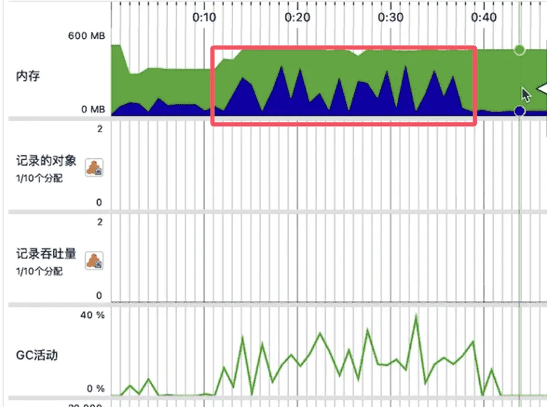

**JavaScript 中的内存泄漏如同慢性毒药——悄无声息地侵蚀性能，最终导致应用崩溃。**
如果你的网页应用出现运行越来越慢、内存占用过高或意外崩溃的情况，很可能正面临内存泄漏问题。最糟糕的是？它们往往在造成严重损害后才被发现。
本文将为你揭示：
- JS 内存泄漏的常见诱因 
- 如何使用 Chrome DevTools 检测泄漏 
- 典型泄漏模式（及修复方案） 
- 预防泄漏的最佳实践

### 一、什么是内存泄漏？
当应用意外持有不再需要的对象，导致垃圾回收机制无法释放内存时，就会发生内存泄漏。随着时间推移，这些"内存垃圾"会不断堆积，最终拖慢（或击垮）你的应用。

#### 内存泄漏的本质
在 JavaScript 中，垃圾回收器（Garbage Collector, GC）负责自动回收不再使用的内存。然而，当某些对象被错误地保留引用时，GC 无法识别它们为"垃圾"，导致内存无法释放。这种意外保留的引用就是内存泄漏的根源。

> 小知识：JavaScript 采用**标记-清除（Mark-and-Sweep）**算法进行垃圾回收。GC 会从根对象（如全局对象、活动栈帧）出发，标记所有可达对象，然后清除未被标记的内存。

### 二、JavaScript 四大内存泄漏元凶
#### 1. 被遗忘的定时器
~~~js
// 泄漏！即使组件已卸载，setInterval 仍在运行
function startTimer() {
  setInterval(()**** => {
    console.log("定时器仍在运行...");
  }, 1000);
}

// 修复方案：务必清除定时器
let intervalId;
function startTimer() {
  intervalId = setInterval(() => {
    console.log("定时运行...");
  }, 1000);
}
function stopTimer() {
  clearInte
  rval(intervalId);
}
~~~

🚨 **特别注意**：React 组件卸载后未清除的定时器会导致内存泄漏。

##### 深入解析定时器泄漏

`定时器（setInterval/setTimeout）`创建的函数会持有对上下文对象的引用。在 React 组件中，如果定时器未在组件卸载时清除，即使组件已从 DOM 中移除，定时器仍会继续执行，并保持对组件实例的引用，导致整个组件树无法被垃圾回收。
~~~jsx
// React 组件中的定时器泄漏示例
function MyComponent() {
  useEffect(() => {
    const timer = setInterval(() => {
      console.log("组件已卸载但定时器仍在运行！");
    }, 1000);
  
    // 忘记返回清理函数
    // return () => clearInterval(timer);
  
    return () => {
      clearInterval(timer);
      console.log("定时器已清除");
    };
  }, []);

  return 
我会泄漏内存
;
}
~~~

#### 2. 游离的事件监听器
~~~js
// 泄漏！元素移除后监听器仍存在
document.getElementById('button').addEventListener('click', onClick);

// 修复方案：及时移除监听器
const button = document.getElementById('button');
button.addEventListener('click', onClick);

// 使用后...
button.removeEventListener('click', onClick);
~~~
🔥 **专业建议**：在 React 中，务必在`useEffect`的清理函数中移除事件监听。

##### 事件监听器泄漏的原理
DOM 元素的事件监听器会创建对事件处理函数的引用。如果元素从 DOM 中移除但监听器未移除，处理函数仍会保持对 DOM 元素或其他相关对象的引用，导致这些对象无法被回收。

在 React 中，事件监听器通常通过 `useEffect` 添加，因此应在清理函数中移除：
~~~jsx
useEffect(() => {
  const handleResize = () => {
    console.log("窗口大小改变");
  };

  window.addEventListener('resize', handleResize);

  // 清理函数
  return () => {
    window.removeEventListener('resize', handleResize);
  };
}, []);
~~~

#### 3. 闭包持有引用
~~~js
// 泄漏！闭包导致 bigData 无法释放
function processData() {
  const bigData = new Array(1000000).fill("💾");
  return function() {
    console.log("闭包仍持有 bigData 内存！");
  };
}

const leakedFn = processData();
// 只要 leakedFn 存在，bigData 就无法被垃圾回收
~~~

💡 **修复方案**：处理完大型变量后显式置为 null。

##### 闭包泄漏的深层原因

闭包会捕获外部函数的变量。如果闭包被长期持有（如赋值给全局变量或存储在事件监听器中），它所捕获的变量（尤其是大型对象）将无法被垃圾回收。
~~~js
// 修复闭包泄漏的示例
function processData() {
  const bigData = new Array(1000000).fill("💾");

  // 使用后立即释放
  bigData = null;

  return function() {
    console.log("闭包不再持有 bigData");
  };
}
~~~
##### 3. 游离的 DOM 节点
~~~js
// 泄漏！移除的 DOM 节点仍被 JS 引用
let detachedNode = document.createElement('div');
document.body.appendChild(detachedNode);

// 移除后...
document.body.removeChild(detachedNode);
// 但 detachedNode 仍存在于内存中！
~~~
✅ **解决方案**：移除节点后执行 detachedNode = null。

**DOM 节点泄漏的常见场景**

1. **引用未清除**：即使 DOM 节点已从树中移除，JavaScript 变量仍引用它。
2. **事件委托**：父元素的事件监听器可能仍引用已移除的子元素。
3. **缓存未清理**：如 document.getElementById 返回的引用未被释放。
~~~js
// 修复 DOM 节点泄漏
function createAndRemoveNode() {
  const node = document.createElement('div');
  document.body.appendChild(node);

  // 使用后...
  document.body.removeChild(node);
  node = null; // 显式释放引用
}
~~~

### 三、如何检测内存泄漏？
> 使用 Chrome DevTools → Memory 面板：
#### 1. 拍摄堆快照（Heap Snapshot）
1. 打开 Chrome DevTools（F12 或右键检查）。
2. 切换到 Memory 面板。
3. 选择 Heap Snapshot 选项。
4. 点击 Take Snapshot 按钮多次（操作前后各拍一次）。
5. 对比快照，查找新增但未被释放的对象。
   
**堆快照分析技巧**
- Comparison 模式：对比两次快照，找出新增的对象。
- Statistics 视图：查看哪些构造函数占用了最多内存。
- Retainers 面板：追踪对象的引用链，找出泄漏源头。

#### 2.记录内存分配时间线（Allocation Timeline）
1. 在 Memory 面板选择 Allocation instrumentation on timeline。
2. 执行可能触发泄漏的操作。
3. 停止记录后，查看内存分配情况。
4. 定位持续增长的内存分配区域。

#### 3. 查看性能监控器（Performance Monitor）
1. 打开 DevTools 的 Performance 面板。
2. 点击左下角的 Performance Monitor。
3. 观察以下指标：
  - JS 堆大小（Heap Size）
  - 文档节点数（DOM Nodes）
  - 事件监听器数（Event Listeners）

**性能监控器警示信号**
- JS 堆大小持续增长：表明存在泄漏。
- DOM 节点数异常高：可能是 DOM 节点泄漏。
- 事件监听器数不匹配：说明有未移除的监听器。

### 四、避免泄漏的最佳实践
#### 1. 及时清理定时器和事件监听
~~~js
// 使用 WeakMap 管理定时器
const timerMap = new WeakMap();

function setupTimer(element) {
  const timer = setInterval(() => {
    console.log("定时器运行");
  }, 1000);

  timerMap.set(element, timer);

  return () => {
    clearInterval(timerMap.get(element));
    timerMap.delete(element);
  };
}
~~~

#### 2. 避免全局变量
全局变量会一直存在于内存中，直到页面刷新。使用模块化设计或立即执行函数（IIFE）限制作用域：

~~~js
// 避免全局污染
(function() {
  const data = "不会被全局污染";
  // ...
})();
~~~

#### 3. 使用 WeakMap/WeakSet 实现缓存
WeakMap 和 WeakSet 的键是弱引用，当键对象被垃圾回收时，对应的条目会自动清除：
~~~js
// 使用 WeakMap 缓存 DOM 元素关联数据
const elementCache = new WeakMap();

function cacheElement(element, data) {
  elementCache.set(element, data);
}

// 当 element 被移除时，缓存会自动清理
~~~

#### 4. 长期运行测试
**通过 DevTools 监测内存变化**：
1. 打开 Performance 面板。
2. 点击 Record 按钮，长时间运行应用。
3. 观察内存曲线是否持续上升。

**内存泄漏的典型曲线**
- 正常情况：内存使用在 GC 后回落。
- 泄漏情况：内存持续增长，GC 后仍保持高位。

### 五、常见泄漏场景与解决方案
#### 场景1：React 组件中的事件监听
~~~jsx
// 泄漏示例
function MyComponent() {
  useEffect(() => {
    window.addEventListener('scroll', handleScroll);
    // 忘记返回清理函数
  }, []);

  // 修复
  useEffect(() => {
    window.addEventListener('scroll', handleScroll);
    return () => {
      window.removeEventListener('scroll', handleScroll);
    };
  }, []);
}
~~~

#### 场景2：Vue 组件中的定时器
~~~js
// 泄漏示例
export default {
  mounted() {
    this.timer = setInterval(this.updateData, 1000);
  },
  // 忘记在 beforeDestroy 中清除
  // 修复
  beforeDestroy() {
    clearInterval(this.timer);
  }
};
~~~

#### 场景3：第三方库的订阅未取消
~~~js
// 泄漏示例
const unsubscribe = store.subscribe(this.handleStoreChange);
// 忘记调用 unsubscribe()

// 修复
const unsubscribe = store.subscribe(this.handleStoreChange);
return () => unsubscribe();
~~~

### 六、内存泄漏的调试技巧
**使用 console.count 追踪引用**
~~~js
function createLargeObject() {
  const largeObj = new Array(1000000).fill("data");
  console.count("largeObj 创建次数");
  return largeObj;
}
~~~

**检查闭包中的大型对象**
~~~js
function createClosure() {
  const bigData = new Array(1000000);
  return function() {
    // 检查 bigData 是否被意外引用
    console.log(bigData);
  };
}
~~~

**使用 Chrome 的 --js-heap-size 限制**
~~~base
限制堆内存为 256MB
chrome --js-heap-size=256
~~~
当内存超过限制时，浏览器会抛出错误，帮助定位泄漏。

### 总结
内存泄漏是 JavaScript 开发中常见的问题，它会导致内存占用不断增加，最终影响应用性能和稳定性。通过理解内存管理的基本概念、识别常见泄漏场景、使用 DevTools 进行调试，并遵循最佳实践，可以有效避免和修复内存泄漏。

> 原文地址：https://dev.to/muhammadaqib86/javascript-memory-leaks-the-silent-killers-and-how-to-fix-them-ik2
> 
> 作者：Muhammad Aqib Bin Azam