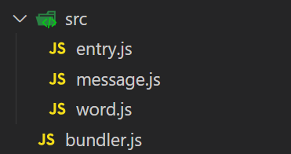
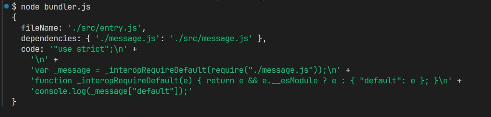
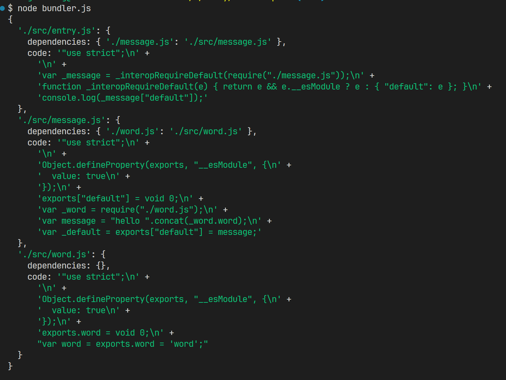

相信大家都学习过webpack的用法，但是它的原理是怎样的呢？，参考webpack官方示例，了解一下打包过程。原地址：https://github.com/ronami/minipack

### 实例文件创建
首先在根目录下创建一个src文件夹，用来保存要打包的文件，在src文件里分别创建word.js、message.js、entry.js三个文件。

~~~js
// word.js
export const word = 'word';
~~~

~~~js
// message.js
import { word } from './word.js';

const message = `hello ${word}`;

export default message;
~~~

~~~js
// entry.js
import message from './message.js';

console.log(message);
~~~

创建完需要打包的代码文件后，再在跟目录创建一个bundler的文件，用于编写我们的打包代码。

### 第一部分：分析入口代码
1. 读取入口文件获取文件内容
2. 提取文件的依赖。借助`@babel/parser`和`@babel/traverse`,通过操作AST抽象语法树提取所有依赖
3. 使用babel对代码进行行转换、编译，把代码转换成浏览器可以认识的es5。借助`@babel/core`和@`babel/preset-env`，提供的 transformFromAst()方法进行转换，这个方法会把ast抽象语法树转换成一个对象并且返回，对象里包含一个code，这个code就是编译生成的，可以在浏览器上直接运行的当前模块的代码

~~~js
const fs = require('fs');
const path = require('path');
const paser = require('@babel/parser');
const traverse = require('@babel/traverse').default;
const babel = require('@babel/core');

/** 模块分析函数 */
function moduleAnalyser(fileName) {
  const content = fs.readFileSync(fileName, 'utf8');
  const ast = paser.parse(content, { sourceType: "module" });
  const dependencies = {};
  traverse(ast, {
    ImportDeclaration({ node }) {
      const dirname = path.dirname(fileName);
      // path.join()方法在Mac系统中输出的结果和在Windows系统中是不一样的，在Mac中输出"/"，在Windows中输出"\\"，所以我们这里需要用到正则进行处理一下
      const newFile = ('./' + path.join(dirname, node.source.value)).replace(/\\/g, '/');
      dependencies[node.source.value] = newFile
    }
  })
  const { code } = babel.transformFromAst(ast, null, {
    presets: ["@babel/preset-env"]
  })

  return { fileName, dependencies, code };

}

const moduleInfo = moduleAnalyser('./src/entry.js');

console.log(moduleInfo);
~~~

### 第二部分：递归解析依赖，生成依赖图谱
1. 先创建新数组graphArray，然后把上面分析出的entryModule保存到数组里
2. 然后对数组graphArray进行遍历，再从遍历的每一项中拿出依赖信息dependencies
3. 然后判断依赖信息dependencies是否存在，如果存在的话，说明这个文件中有依赖，然后再对依赖信息进行遍历，这里需要注意的是，依赖信息dependencies是一个对象，而不是数组，所以要用for...in进行遍历，而不能用for循环
4. 遍历之后，这里再次调用moduleAnalyser方法，对依赖信息里的每一项进行分析
5. 分析出结果之后，再把结果push进graphArray里，这里就实现了递归的效果
这样一来，第一次循环结束的时候，这个graphArray里面不仅有了入口文件，还会多出依赖信息对应的模块，也被分析完成了，这个时候，graphArray的数组长度发生了变化，又会继续进行遍历，接着又会分析下一个依赖信息……反复循环，最后我们就把入口文件、以及依赖文件、以及依赖文件的依赖……一层一层全部推进graphArray里

~~~js
/** 生成依赖图谱函数 */
function makeDependenciesGraph(entry) {
  const entryModule = moduleAnalyser(entry);
  const graphArray = [entryModule];
  for (let i = 0; i < graphArray.length; i++) {
    const item = graphArray[i];
    const { dependencies } = item;
    if (dependencies) {
      for (let j in dependencies) {
        const result = moduleAnalyser(dependencies[j]);
        graphArray.push(result);
      }
    }
  }

  // 数组转换成对象
  const graph = {};
  graphArray.forEach(item => {
    const { fileName, dependencies, code } = item;
    graph[fileName] = { dependencies, code };
  });
  return graph;
};
~~~

### 第三部分：生成代码
网页中的所有代码都应该放在一个大的闭包里面，避免勿扰全局环境，所以第一步，我们要写个闭包，然后在闭包里面把所有的代码都放进去

~~~js
/** 生成代码函数 */
function generateCode(entry) {
  const graph = makeDependenciesGraph(entry);
  return `
  (function(graph){
      function require(module) {
          function localRequire(relativePath) {
              return require(graph[module].dependencies[relativePath]);
          };
          var exports = {};
          (function(require, exports, code) {
              eval(code);
          })(localRequire, exports, graph[module].code);
          return exports;
      };
      require('${entry}');
  })(${JSON.stringify(graph)});
`;
}
~~~

最后整合代码：
~~~js
const fs = require('fs');
const path = require('path');
const paser = require('@babel/parser');
const traverse = require('@babel/traverse').default;
const babel = require('@babel/core');
const { log } = require('console');

/**
 * 第一部分：分析入口代码
 * 1.读取入口文件获取文件内容
 * 2.提取文件的依赖。借助babel/parser和@babel/traverse,通过操作AST抽象语法树提取所有依赖
 * 3.使用babel对代码进行行转换、编译，把代码转换成浏览器可以认识的es5。借助@babel/core和@babel/preset-env，提供
 *  transformFromAst()方法进行转换，这个方法会把ast抽象语法树转换成一个对象并且返回，对象里包含一个code，这个code就是编译生成的，
 *  可以在浏览器上直接运行的当前模块的代码
 */
/** 模块分析函数 */
function moduleAnalyser(fileName) {
  const content = fs.readFileSync(fileName, 'utf8');
  const ast = paser.parse(content, { sourceType: "module" });
  const dependencies = {};
  traverse(ast, {
    ImportDeclaration({ node }) {
      const dirname = path.dirname(fileName);
      // path.join()方法在Mac系统中输出的结果和在Windows系统中是不一样的，在Mac中输出"/"，在Windows中输出"\\"，所以我们这里需要用到正则进行处理一下
      const newFile = ('./' + path.join(dirname, node.source.value)).replace(/\\/g, '/');
      dependencies[node.source.value] = newFile
    }
  })
  const { code } = babel.transformFromAst(ast, null, {
    presets: ["@babel/preset-env"]
  })

  return { fileName, dependencies, code };

}

/**
 * 第二部分：递归解析依赖，生成依赖图谱
 * 1.先创建新数组graphArray，然后把上面分析出的entryModule保存到数组里
 * 2.然后对数组graphArray进行遍历，再从遍历的每一项中拿出依赖信息dependencies
 * 3.然后判断依赖信息dependencies是否存在，如果存在的话，说明这个文件中有依赖，
 *  然后再对依赖信息进行遍历，这里需要注意的是，依赖信息dependencies是一个对象，
 *  而不是数组，所以要用for...in进行遍历，而不能用for循环
 * 4.遍历之后，这里再次调用moduleAnalyser方法，对依赖信息里的每一项进行分析
 * 5.分析出结果之后，再把结果push进graphArray里，这里就实现了递归的效果
 *  这样一来，第一次循环结束的时候，这个graphArray里面不仅有了入口文件，还会多出依赖信息对应的模块，也被
 *  分析完成了，这个时候，graphArray的数组长度发生了变化，又会继续进行遍历，接着又会分析下一个依赖信息……反复循环，
 *  最后我们就把入口文件、以及依赖文件、以及依赖文件的依赖……一层一层全部推进graphArray里
 */
/** 生成依赖图谱函数 */
function makeDependenciesGraph(entry) {
  const entryModule = moduleAnalyser(entry);
  const graphArray = [entryModule];
  for (let i = 0; i < graphArray.length; i++) {
    const item = graphArray[i];
    const { dependencies } = item;
    if (dependencies) {
      for (let j in dependencies) {
        const result = moduleAnalyser(dependencies[j]);
        graphArray.push(result);
      }
    }
  }

  // 数组转换成对象
  const graph = {};
  graphArray.forEach(item => {
    const { fileName, dependencies, code } = item;
    graph[fileName] = { dependencies, code };
  });
  return graph;
};

/**
 * 第三部分：生成代码
 * 网页中的所有代码都应该放在一个大的闭包里面，避免勿扰全局环境，所以第一步，我们要写个闭包，然后在闭包里面把所有的代码都放进去
 */
/** 生成代码函数 */
function generateCode(entry) {
  const graph = makeDependenciesGraph(entry);
  return `
  (function(graph){
      function require(module) {
          function localRequire(relativePath) {
              return require(graph[module].dependencies[relativePath]);
          };
          var exports = {};
          (function(require, exports, code) {
              eval(code);
          })(localRequire, exports, graph[module].code);
          return exports;
      };
      require('${entry}');
  })(${JSON.stringify(graph)});
`;
}

const code = generateCode('./src/entry.js')
console.log(code);

~~~
