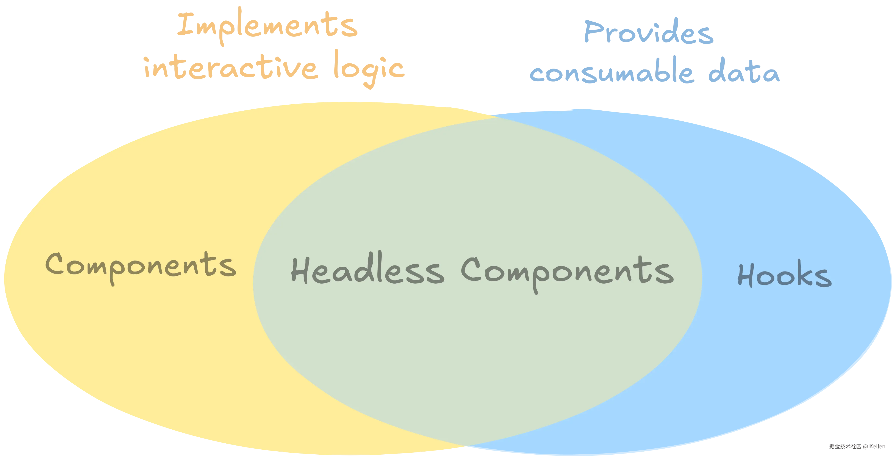
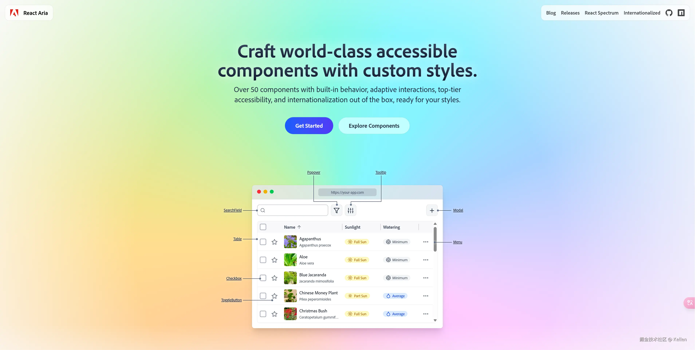
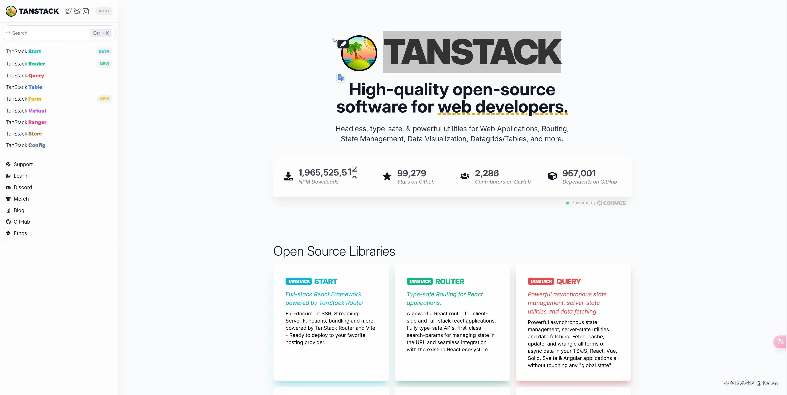
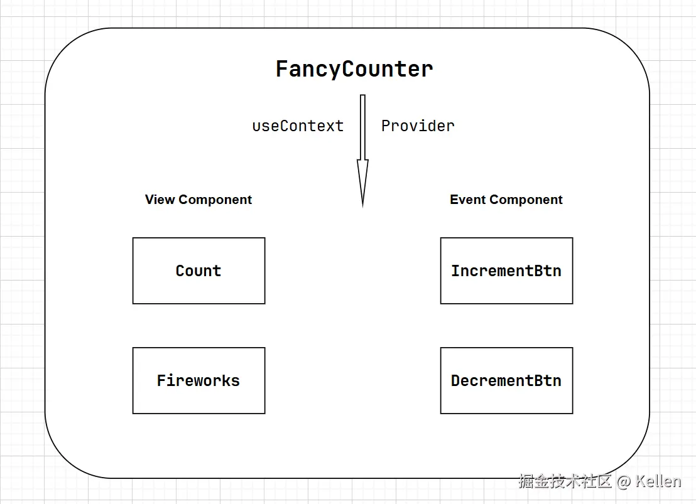
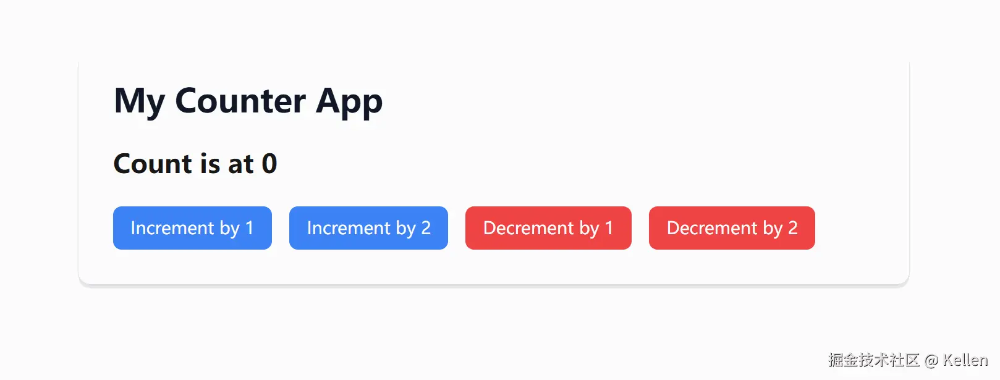

### 话题

> 在前端面试的过程中，我们可能会被问到一个问题：*“组件和钩子有什么区别？”*
>
> 面试官可能想要的答案是  *“组件是 UI 的构建块，而钩子是 React 提供的用于管理状态和副作用的实用函数😴”*  。
>
> 如果你的目标是找工作，这个答案还算令人满意。但如果你想给人留下深刻印象，更大胆的答案是：*“没有区别🔥”*  。

### 首先，什么是组件？

非常技术性的答案是，它是一个返回 `ReactNode` 的函数，它是任何可以在屏幕上呈现的东西（[ 包括 JSX、字符串、数字、空值等等 ](https://github.com/DefinitelyTyped/DefinitelyTyped/blob/58ce30f5d4a40bd82f77882723df24d8ec6fad7c/types/react/index.d.ts#L426-L439)）。

**以下是有效的 React 组件**

```jsx
const MyComponent = () => {
  return "Hello World!";
};
```

组件可以使用 props 来渲染动态输入…

```jsx
const MyComponent = ({ name, onClick }) => {
  return <button onClick={onClick}>Hello {name}!</button>;
};

```

并使用钩子实现有状态的行为。

```jsx
const MyCounter = () => {
  const [count, increment] = useReducer((state) => state + 1, 0);

  return <button onClick={increment}>Counter {count}</button>;
};

```

添加一些额外的操作，这时候我们就可以得到一个使用了 `React Hooks`的`React 组件`

```jsx
const MyFancyCounter = () => {
  const [count, increment] = useReducer((state) => state + 1, 0);

  // Add fancy styles every time `count` doubles
  const fancyClass = useMemo(() => {
    const orderOfMagnitude = Math.floor(Math.log2(count));
    let style = {};

    if (orderOfMagnitude <= 0) return "";

    switch (orderOfMagnitude) {
      case 1:
        return "fancy-1";
      case 2:
        return "fancy-2";
      case 3:
        return "fancy-3";
      default:
        // Beyond 255
        return "fanciest";
    }
  }, [count]);

  return (
    <button onClick={increment} className={fancyClass}>
      Counter {count}
    </button>
  );
};

```

无论我们在实现中做什么，我们都可以通过将其混合到 JSX 中将其用作另一个组件中的`黑盒`。

```jsx
const FancyCounterApp = () => {
  return (
    <div>
      <h1>My Counter App</h1>
      <MyFancyCounter />
    </div>
  );
};

```

### 其次，什么是Hooks?

Hooks 是 React 内置函数，用于管理状态和效果。你可以通过将 React 提供的 hooks 包装在函数中来创建新的 hooks。

钩子可以接受任何输入并返回任何值。唯一的限制是[(Hooks)钩子的规则 ](https://react.dev/warnings/invalid-hook-call-warning)，这些规则规定钩子不能有条件地调用。关键的是，这些规则是*传递性的* ，这意味着任何调用钩子的东西本身都是钩子，并且必须遵循这些规则，直到它在组件中使用为止。

故事的关键就在这里：鉴于组件可传递地继承钩子的所有限制（钩子的规则），并且其输出更加严格（只能返回 `ReactNodes` ）：**组件确实是钩子的*子类型* 。任何组件都可以用作钩子** ！

**举个例子**

我们之前最复杂的组件可以毫不费力地变成一个钩子：

```jsx
// It's prefixed by `use` now, its a hook!
const useFancyCounter = () => {
  const [count, increment] = useReducer((state) => state + 1, 0);

  // Add fancy styles every time `count` doubles
  const fancyClass = useMemo(() => {
    const orderOfMagnitude = Math.floor(Math.log2(count));
    let style = {};

    if (orderOfMagnitude <= 0) return "";

    switch (orderOfMagnitude) {
      case 1:
        return "fancy-1";
      case 2:
        return "fancy-2";
      case 3:
        return "fancy-3";
      default:
        // Beyond 255
        return "fanciest";
    }
  }, [count]);

  return (
    <button onClick={increment} className={fancyClass}>
      Counter {count}
    </button>
  );
};

// use useFancyCounter hooks to get ReactNode
const FancyCounterApp = () => {
  const myFancyCounter = useFancyCounter();  // ⭐⭐⭐
  
  return (
    <div>
      <h1>My Counter App</h1>
      {myFancyCounter}  // ⭐⭐⭐
    </div>
  );
};

```

到目前为止，这看起来似乎是无趣的语义，但这个练习有一个实际的一面。

### 无头组件

如前所述，组件的显著特征是它返回一个 `ReactNode` 。就 API 而言， `ReactNode` 是一个黑盒。由于 `useFancyCounter()` 仍返回一个 `ReactNode` ，因此其内部状态是不透明且不可使用的。

> 这个限制很重要，因为它阻止 `FancyCounterApp` 轻松实现以下功能：
>
> *   将 `{count}` 渲染到 `<button>` 之外，在任意的React组件中使用
> *   添加另一个按钮以将计数增加 2
> *   一旦计数达到 10，就执行一些事件

由于 `useFancyCounter` 是一个钩子，它不是返回 `ReactNode` ，而是可以公开其事件处理程序和状态，在使用这个hooks的组件中可以利用它们获得更灵活的输出：

```jsx
// It's prefixed by `use` now, its a hook!
const useFancyCounter = () => {
  const [count, increment] = useReducer((state) => state + 1, 0);

  // Add fancy styles every time `count` doubles
  const fancyClass = useMemo(() => {
    const orderOfMagnitude = Math.floor(Math.log2(count));
    let style = {};

    if (orderOfMagnitude <= 0) return "";

    switch (orderOfMagnitude) {
      case 1:
        return "fancy-1";
      case 2:
        return "fancy-2";
      case 3:
        return "fancy-3";
      default:
        // Beyond 255
        return "fanciest";
    }
  }, [count]);

  return { fancyClass, increment, count };
};

```

`useFancyCounter` 现在是一个**无头组件** ，因为它实现了所有与组件相关的功能（事件处理、状态管理、样式），但允许其调用者将其提炼为 JSX，而不是返回预先烘焙的 `ReactNode` 。



> *无头组件是实现组件级逻辑的钩子*这种模式的灵活性是无与伦比的，没有基于组合的解决方案所带来的样板。

```jsx
const FancyCounterApp = () => {
  const { fancyClass, increment, count } = useFancyCounter();

  // performing some event once the count reaches 10
  useEffect(() => {
    if (count === 10) {
      showFireworks();
    }
  }, [count]);

  return (
    <div>
      <h1>My Counter App</h1>
      {/* 👇⭐⭐⭐👇*/}
      {/* rendering the `{count}` outside of the `<button>` */}
      <h2>Count is at {count}</h2>
      <button
        onClick={increment}
        // extend button styling
        className={clsx(fancyClass, "some-other-class")}
      >
        Increment by 1
      </button>
      {/* adding another button to increment the count by two */}
      <button
        onClick={() => {
          increment();
          increment();
        }}
      >
        Increment by 2
      </button>
    </div>
  );
};

```

### 单元测试

无头组件有效地将视图与视图模型分离，使它们可以单独测试。

```jsx
// Testing full component
describe("FancyCounterApp", () => {
  it("increments", () => {
    render(<FancyCounterApp />);

    const incrementBtn = screen.findByLabel("Increment by 1");

    fireEvent.click(incrementBtn);
    fireEvent.click(incrementBtn);
    fireEvent.click(incrementBtn);

    expect("Count is at 3").toBeInDocument();
  });
});

// Testing component logic only
describe("useFancyCounter", () => {
  it("increments", () => {
    const { result } = renderHook(() => useFancyCounter());

    act(() => result.current.increment());
    act(() => result.current.increment());
    act(() => result.current.increment());

    expect(result.current.count).toBe(3);
  });
});

```

### 组合 + 无头组件

虽然无头组件通常解决与组合相同类型的挑战，但这两种模式是兼容的。

如果你希望在将控制器作为独立单元的同时实现控制反转，则此组合模式非常有用。附加的好处是能够在使用上下文的组件和不使用上下文的组件之间重用视图模型逻辑。

目前也有比较成熟的无头组件库，比如：

[React Aria](https://react-spectrum.adobe.com/react-aria/index.html)



[TanStack](https://tanstack.com/)



[Headless UI](https://headlessui.com/)


### 小练习

咱们也简单写一个组合 + 无头组件吧

分别创造以下组件:

*   视图组件：`Count`、`Fireworks`
*   事件组件：`IncrementBtn`、`DecrementBtn`
*   顶层组件：`FancyCounter`



1.  首先我们简单改造一下上述内容的 `useFancyCounter` Hooks

```tsx
import { useMemo, useReducer } from "react";

export function useFancyCounter() {
  const [count, dispatch] = useReducer((state, action) => {
    switch (action.type) {
      case 'increment':
        return state + 1;
      case 'decrement':
        return Math.max(0, state - 1);
      default:
        return state;
    }
  }, 0);

  const increment = () => dispatch({ type: 'increment' });
  const decrement = () => dispatch({ type: 'decrement' });

  // 每次计算添加一些样式
  const fancyClass = useMemo(() => {

    switch (count) {
      case 1:
        return "text-red-400";
      case 2:
        return "text-green-400";
      case 3:
        return "text-blue-400";
      default:
        return "";
    }
  }, [count]);

  return { fancyClass, increment, decrement, count };
};
```

2.  写一下`FancyCounter` 顶层组件

```tsx
interface FancyCounterProps {
  children: ReactNode
}

interface FancyCounterContextType {
  count: number
  increment: () => void
  decrement: () => void
  fancyClass: string
}

// 创建Context 通过 Context.Provider 向下派发数据
const FancyCounterContext = createContext<FancyCounterContextType | null>(null)

const useFancyCounterContext = () => {
  const context = useContext(FancyCounterContext)
  if (!context) {
    throw new Error('useFancyCounterContext must be used within FancyCounter')
  }
  return context
}

const FancyCounter = ({ children }: FancyCounterProps) => {
  const { count, increment, decrement, fancyClass } = useFancyCounter()
  
  return (
    <FancyCounterContext.Provider value={{ count, increment, decrement, fancyClass }}>
      {children}
    </FancyCounterContext.Provider>
  )
}

```

3.  再写一下视图组件：`Count`、`Fireworks`

```tsx
const Count = () => {
  const { count, fancyClass} = useFancyCounterContext()
  return <h2 className={clsx("text-2xl font-bold mb-4", fancyClass)}>Count is at {count}</h2>
}


const Fireworks = (props: { at: number }) => {
  const { count } = useFancyCounterContext()

  if (count === props?.at) {
    return <span>🎆 Fireworks!</span>
  }
  
  return null
}
```

4.  以及事件组件：`IncrementBtn`、`DecrementBtn`

```tsx
interface IncrementBtnProps {
  children: ReactNode
  by?: number
}

const IncrementBtn = ({ children, by = 1 }: IncrementBtnProps) => {
  const { increment } = useFancyCounterContext()
  
  return (
    <button
      onClick={() => {
        for (let i = 0; i < by; i++) {
          increment()
        }
      }}
      className={clsx(
        "px-4 py-2 rounded-lg font-medium transition-colors duration-200 w-fit",
        "bg-blue-500 hover:bg-blue-600 text-white",
        "focus:outline-none focus:ring-2 focus:ring-blue-500 focus:ring-offset-2",
      )}
    >
      {children}
    </button>
  )
}

interface DecrementBtnProps {
  children: ReactNode
  by?: number
}

const DecrementBtn = ({ children, by = 1 }: DecrementBtnProps) => {
  const { decrement } = useFancyCounterContext()
  
  return (
    <button
      onClick={() => {
        for (let i = 0; i < by; i++) {
          decrement()
        }
      }}
      className={clsx(
        "px-4 py-2 rounded-lg font-medium transition-colors duration-200 w-fit no",
        "bg-red-500 hover:bg-red-600 text-white",
        "focus:outline-none focus:ring-2 focus:ring-red-500 focus:ring-offset-2",
      )}
    >
      {children}
    </button>
  )
}
```

5.  最后再组装到一起

```tsx
FancyCounter.Count = Count
FancyCounter.IncrementBtn = IncrementBtn
FancyCounter.DecrementBtn = DecrementBtn
FancyCounter.Fireworks = Fireworks

export { FancyCounter } 
```

6.  最最后再试着使用一下

```tsx
import { FancyCounter } from '../components/FancyCounter'

export default function HeadlessDemo() {
  return (
    <div className="min-h-screen bg-gray-50 py-12 px-4 sm:px-6 lg:px-8">
      <div className="max-w-md mx-auto bg-white rounded-xl shadow-md overflow-hidden md:max-w-3xl p-8">
        <FancyCounter>
          <FancyCounter.Fireworks at={10} />
          <div className="space-y-6">
            <h1 className="text-3xl font-bold text-gray-900">My Counter App</h1>
            <FancyCounter.Count />
            <div className="flex space-x-4">
              <FancyCounter.IncrementBtn by={1}>
                Increment by 1
              </FancyCounter.IncrementBtn>
              <FancyCounter.IncrementBtn by={2}>
                Increment by 2
              </FancyCounter.IncrementBtn>
              <FancyCounter.DecrementBtn by={1}>
                Decrement by 1
              </FancyCounter.DecrementBtn>
              <FancyCounter.DecrementBtn by={2}>
                Decrement by 2
              </FancyCounter.DecrementBtn>
            </div>
          </div>
        </FancyCounter>
      </div>
    </div>
  )
} 
```

芜湖莫得问题


### 结论

人们很容易忽视组件和钩子并不是独立的概念，因为它们总是表现为不同的原语。一旦被接受，无头组件就会成为一种明显的模式，能够实现更高的逻辑可重用性、灵活性和卓越的测试模式。

引用文章：[Components Are Just Sparkling Hooks](https://www.bbss.dev/posts/sparkling-hooks/)
